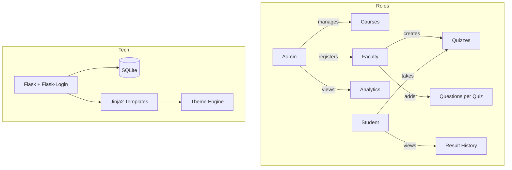

# Online Quiz System — Complete Overhaul

Transform the basic quiz app into a **production-ready, role-based online quiz platform** with premium UI, session management, and real-world features.

## Current State

The existing app is a minimal Flask project with:
- Single `users` table (no roles), `questions` table (no course linkage), `results` table (no user_id linkage)
- No session persistence / Flask-Login
- Plain Bootstrap UI with no theming
- Admin routes unprotected
- No faculty concept, no courses

## Proposed Architecture



---

## Proposed Changes

### 1. Database Schema Redesign

#### [MODIFY] [database.py](file:///d:/WORK/Projects/Internship-Shamnas/online-quiz-system/database.py)

Complete rewrite with new tables:

| Table | Purpose |
|-------|---------|
| `users` | All users with `role` field (admin/faculty/student) |
| `courses` | Course catalog (name, code, description, created_by) |
| `faculty_courses` | Many-to-many: faculty ↔ courses |
| `quizzes` | Quiz metadata (title, course_id, faculty_id, duration, is_active) |
| `questions` | Questions linked to a quiz_id (not global) |
| `quiz_attempts` | Student attempt records (user_id, quiz_id, score, total, started_at, completed_at) |
| `attempt_answers` | Individual answers per attempt for review |

- Auto-create a default admin account (`admin@quiz.com` / `admin123`)
- Migrate from raw sqlite3 to still use sqlite3 but with a proper helper module

---

### 2. Backend — Flask Application

#### [MODIFY] [app.py](file:///d:/WORK/Projects/Internship-Shamnas/online-quiz-system/app.py)

Complete rewrite organized into sections:

**Session & Auth:**
- Use `flask-login` for session management (remember me, session persistence)
- Login decorator for all protected routes
- Role-based access decorators (`@admin_required`, `@faculty_required`, `@student_required`)
- Flash messages for all user feedback (success/error)

**Admin Routes:**
| Route | Method | Description |
|-------|--------|-------------|
| `/admin/dashboard` | GET | Stats overview (total students, faculty, courses, quizzes) |
| `/admin/courses` | GET/POST | List & create courses |
| `/admin/courses/<id>/edit` | GET/POST | Edit a course |
| `/admin/courses/<id>/delete` | POST | Delete a course |
| `/admin/faculty` | GET/POST | List faculty & register new faculty |
| `/admin/faculty/<id>/delete` | POST | Remove a faculty member |
| `/admin/students` | GET | View all students |
| `/admin/results` | GET | View all quiz results |

**Faculty Routes:**
| Route | Method | Description |
|-------|--------|-------------|
| `/faculty/dashboard` | GET | Faculty home — their courses & quizzes |
| `/faculty/quizzes` | GET/POST | List & create quizzes (select course) |
| `/faculty/quizzes/<id>/questions` | GET/POST | Add/manage questions for a quiz |
| `/faculty/quizzes/<id>/toggle` | POST | Activate/deactivate a quiz |
| `/faculty/quizzes/<id>/results` | GET | View student results for a quiz |

**Student Routes:**
| Route | Method | Description |
|-------|--------|-------------|
| `/dashboard` | GET | Student home — available quizzes by course |
| `/quiz/<id>` | GET | Take a quiz |
| `/quiz/<id>/submit` | POST | Submit quiz answers |
| `/results` | GET | Result history with scores, dates, percentages |
| `/results/<attempt_id>` | GET | Detailed result review |

**General Routes:**
| Route | Method | Description |
|-------|--------|-------------|
| `/` | GET | Landing page |
| `/login` | GET/POST | Unified login (redirects based on role) |
| `/register` | GET/POST | Student self-registration |
| `/logout` | GET | Clear session |
| `/set-theme/<theme>` | POST | Set theme preference in session |
| `/leaderboard` | GET | Public leaderboard |
| `/profile` | GET/POST | Edit profile |

#### [NEW] [helpers.py](file:///d:/WORK/Projects/Internship-Shamnas/online-quiz-system/helpers.py)

- `get_db()` — database connection helper
- `@admin_required`, `@faculty_required`, `@login_required` decorators
- `init_db()` — initialize schema + seed admin

---

### 3. UI / Templates — Premium Redesign

#### Design System

- **No Bootstrap** — Custom CSS with CSS variables for theming
- **Google Font**: Inter (clean, modern)
- **Icons**: Lucide Icons (lightweight SVG icon set via CDN)
- **Color palette**: Deep indigo/violet primary, warm accents
- **Glassmorphism** cards with backdrop blur
- **Micro-animations**: Fade-in on load, hover lifts, smooth transitions
- **Responsive**: Mobile-first, works on all screen sizes

#### Theme System (3 themes stored in session/cookie)

| Theme | Description |
|-------|-------------|
| 🌙 **Dark** (default) | Deep navy/slate background, glowing accents |
| ☀️ **Light** | Clean white/gray, sharp contrast |
| 🌈 **Violet** | Rich purple gradients, neon accents |

Themes are implemented via CSS custom properties (`--bg-primary`, `--text-primary`, etc.) toggled by a `data-theme` attribute on `<html>`.

#### Template Structure

```
templates/
├── base.html              ← Master layout (nav, theme switcher, footer)
├── index.html             ← Landing page (hero, features, CTA)
├── login.html             ← Unified login
├── register.html          ← Student registration
├── student/
│   ├── dashboard.html     ← Available quizzes grouped by course
│   ├── quiz.html          ← Quiz taking interface with timer
│   ├── result.html        ← Single result view
│   ├── results.html       ← Result history table
│   └── profile.html       ← Profile page
├── faculty/
│   ├── dashboard.html     ← Faculty overview
│   ├── quizzes.html       ← Quiz list + create
│   ├── questions.html     ← Manage questions for a quiz
│   └── results.html       ← Student results for a quiz
├── admin/
│   ├── dashboard.html     ← Admin stats overview
│   ├── courses.html       ← Course management
│   ├── faculty.html       ← Faculty management
│   ├── students.html      ← Student list
│   └── results.html       ← All results
└── leaderboard.html       ← Public leaderboard
```

#### [NEW] [static/css/style.css](file:///d:/WORK/Projects/Internship-Shamnas/online-quiz-system/static/css/style.css)

Complete design system with:
- CSS custom properties for all 3 themes
- Typography scale
- Glass card components
- Form styling
- Table styling
- Animations & transitions
- Responsive grid
- Navigation & sidebar
- Theme switcher widget

#### [NEW] [static/js/app.js](file:///d:/WORK/Projects/Internship-Shamnas/online-quiz-system/static/js/app.js)

- Theme switcher logic (saves to localStorage + cookie for server-side)
- Quiz timer with visual countdown
- Form validation
- Toast/notification system
- Smooth page transitions
- Confirmation dialogs for delete actions

---

### 4. Additional Real-World Features (My Ideas)

| Feature | Description |
|---------|-------------|
| **Quiz Timer** | Per-quiz configurable duration with visual circular countdown |
| **Quiz Activation** | Faculty can activate/deactivate quizzes |
| **Score Analytics** | Students see avg score, best score, total quizzes taken |
| **Flash Messages** | Toast-style notifications for all actions |
| **Profile Page** | Users can view and update their profile |
| **Password Hashing** | Already using werkzeug, will keep it |
| **Remember Me** | Flask-Login remember me functionality |
| **Responsive Design** | Works on mobile, tablet, desktop |
| **Empty States** | Friendly illustrations when no data exists |
| **Confirmation Dialogs** | Before destructive actions (delete) |
| **Auto-redirect** | If logged in, redirect away from login/register |

---

## User Review Required

> [!IMPORTANT]
> The existing `database.db` will need to be **recreated** since the schema is completely changing. Any existing data (users, questions, results) will be lost. The new database will be seeded with a default admin account.

> [!IMPORTANT]
> Default admin credentials will be `admin@quiz.com` / `admin123`. You should change these after first login.

## Open Questions

> [!NOTE]
> 1. Should students be able to retake quizzes, or only attempt each quiz once?  
>    **My default**: Allow retakes, show all attempts in history.
>
> 2. Should there be an enrollment system (students enroll in courses), or can all students see all active quizzes?  
>    **My default**: All active quizzes visible to all students (simpler for now).
>
> 3. Any specific branding (logo, app name) you'd like, or keep "QuizMaster"?  
>    **My default**: Will use "QuizMaster" as the app name.

---

## Verification Plan

### Automated Tests
- Run `python database.py` to verify schema creation and admin seeding
- Run `python app.py` and test all routes in browser
- Test login/session persistence across page refreshes
- Test role-based access (student can't access admin routes, etc.)

### Manual Browser Verification
- Register a student → login → take quiz → view results history
- Login as admin → create course → register faculty
- Login as faculty → create quiz with questions → activate it
- Theme switching across all pages
- Mobile responsiveness check
- Timer functionality during quiz

### Files Changed Summary
| Action | File | Description |
|--------|------|-------------|
| MODIFY | `database.py` | New schema with roles, courses, quizzes |
| MODIFY | `app.py` | Complete rewrite with role-based routes |
| MODIFY | `requirements.txt` | Add flask-login |
| NEW | `helpers.py` | DB helper, decorators |
| NEW | `static/css/style.css` | Premium design system |
| NEW | `static/js/app.js` | Theme, timer, interactions |
| NEW | `templates/base.html` | Master layout |
| MODIFY | `templates/index.html` | Premium landing page |
| MODIFY | `templates/login.html` | Redesigned login |
| MODIFY | `templates/register.html` | Redesigned registration |
| NEW | `templates/student/dashboard.html` | Student home |
| NEW | `templates/student/quiz.html` | Quiz interface |
| NEW | `templates/student/result.html` | Single result |
| NEW | `templates/student/results.html` | Result history |
| NEW | `templates/student/profile.html` | Profile page |
| NEW | `templates/faculty/dashboard.html` | Faculty home |
| NEW | `templates/faculty/quizzes.html` | Quiz management |
| NEW | `templates/faculty/questions.html` | Question management |
| NEW | `templates/faculty/results.html` | Quiz results view |
| NEW | `templates/admin/dashboard.html` | Admin overview |
| NEW | `templates/admin/courses.html` | Course management |
| NEW | `templates/admin/faculty.html` | Faculty management |
| NEW | `templates/admin/students.html` | Student list |
| NEW | `templates/admin/results.html` | All results |
| NEW | `templates/leaderboard.html` | Leaderboard |
| DELETE | `templates/dashboard.html` | Replaced by role-specific dashboards |
| DELETE | `templates/quiz.html` | Replaced by student/quiz.html |
| DELETE | `templates/result.html` | Replaced by student/result.html |
| DELETE | `templates/admin/add_question.html` | Replaced by faculty/questions.html |
| DELETE | `templates/admin/admin_dashboard.html` | Replaced by admin/dashboard.html |
| DELETE | `templates/admin/edit_question.html` | Replaced by faculty/questions.html |
